```{r setup, include=FALSE}
knitr::opts_chunk$set(echo = FALSE)
```

<!-- Hi Anirudh,

The general guideline is to make it accessible to a wider audience, explain what is the motivating problem, and how you have proposed to solve it, but without the technical details.

Best,
Dimitris
-->

## Chronic Non-communicable Diseases
- Low grade Cancer
- Chronic heart disease
- Renal disease
- Cardiovascular disease

## Aggressive Treatment Upon Diagnosis Is Not Always Suitable
- A 55 years old heart disease patient is diagnosed with low-grade prostate cancer on PSA screening. No symptoms otherwise.
    - side effects of prostatectomy or radiotherapy
    - comorbidities: heart disease
    - better quality of life if we don't treat cancer immediately

    
## Delay Treatment Until Disease Progresses


## Surveillance: Monitoring Disease State
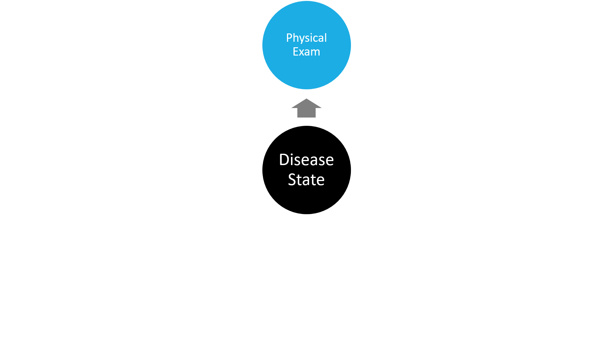

## Monitoring Disease State
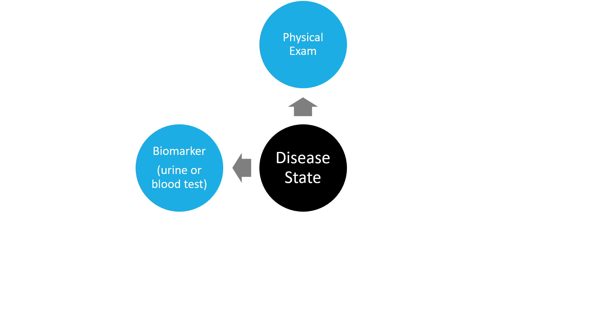

## Monitoring Disease State
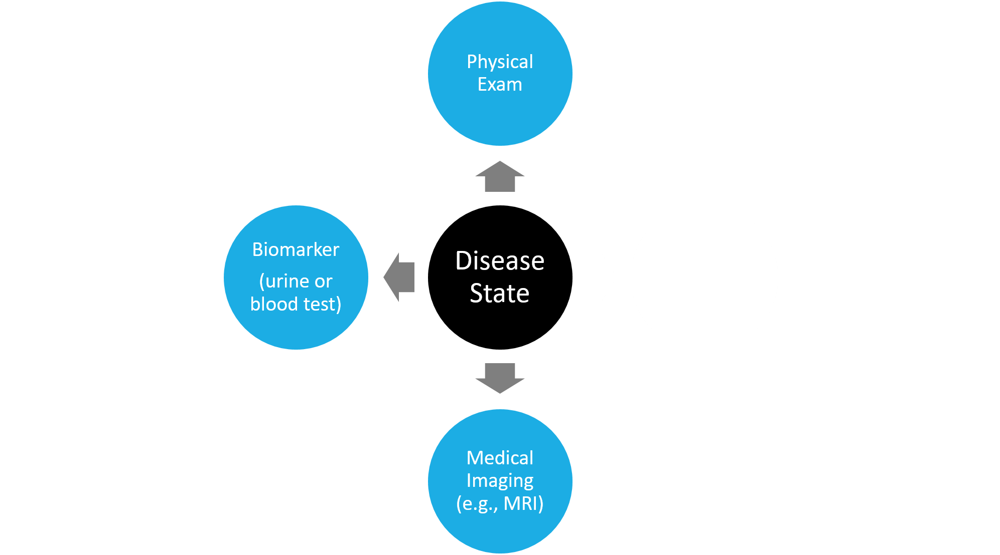

## Reference Tests (Invasive) Confirm Disease State
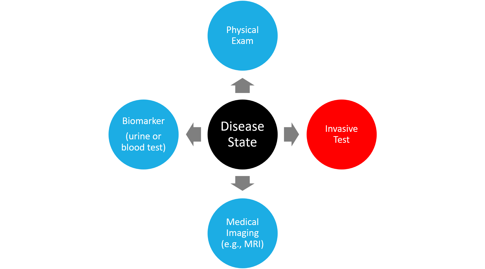

## Invasive Test Examples
- Biopsy (Prostate cancer)
- Endoscopy (Barett's esophagus)
- Colonoscopy (Colorectal cancer)
- Bronchoscopy (Lung transplant)

## Tests Are Conducted Repeatedly


## But There is a Problem
<span style='color: green'> Benefit </span>

  - Accurate, and confirm disease progression

<span style='color: red'> Burden: Complications </span>

  - Blood loss due to colon perforation
  - Septicemia
  - Incontinence
  - Non-compliance (risk of delayed detection of progression)

<!-- ## Surveillance Frequency Tradeoff
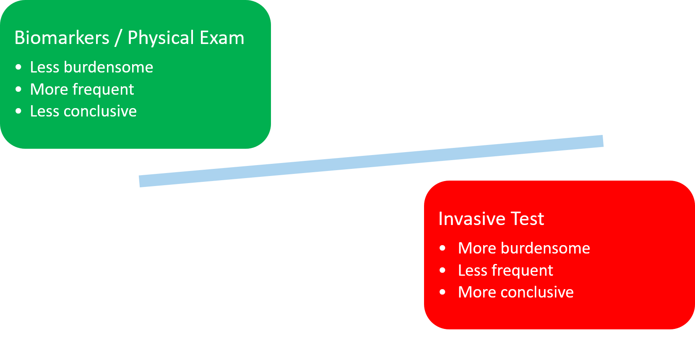
-->

# Key Question: How Often Should Invasive Tests Be Conducted?

## Current Approach Across Diseases
- One-size fits all (e.g., biopsy every year)
- Flowchart rule / sub-group based personalization
    - use biomarkers, physical examination, medical imaging results

## Drawbacks
- One-size fits all fixed schedules
    - Do not differentiate between slow and fast progressing patients.
    - Initial test schedules are often more conservative.
    - And it takes time before another frequency is proposed.

- Flowchart issues:
    - Observed data has measurement error.
    - Often use only the last data point.
    - Decision cutoff on continuous data can be arbitrary.

### <span style='color: red'>Limited Focus on Burden and Benefit of Testing </span>
Patients should know more on why should they choose a certain schedule.

## Aim: Use Data of Each Patient
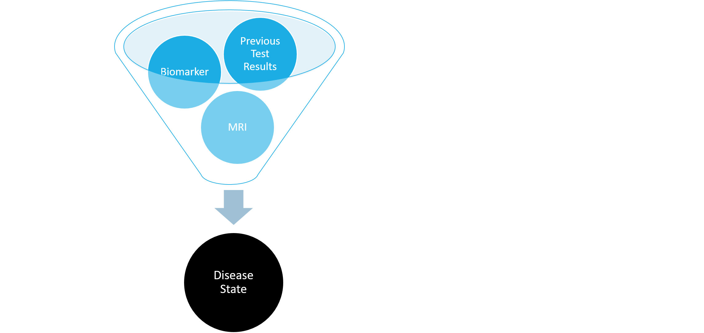

## Aim: Personalized Schedule
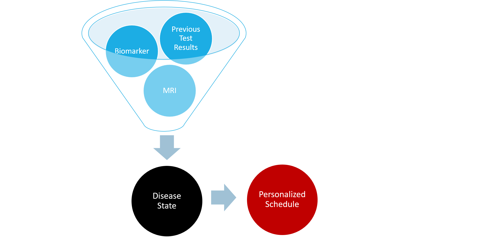

## Unique Informative Schedule for Each Patient
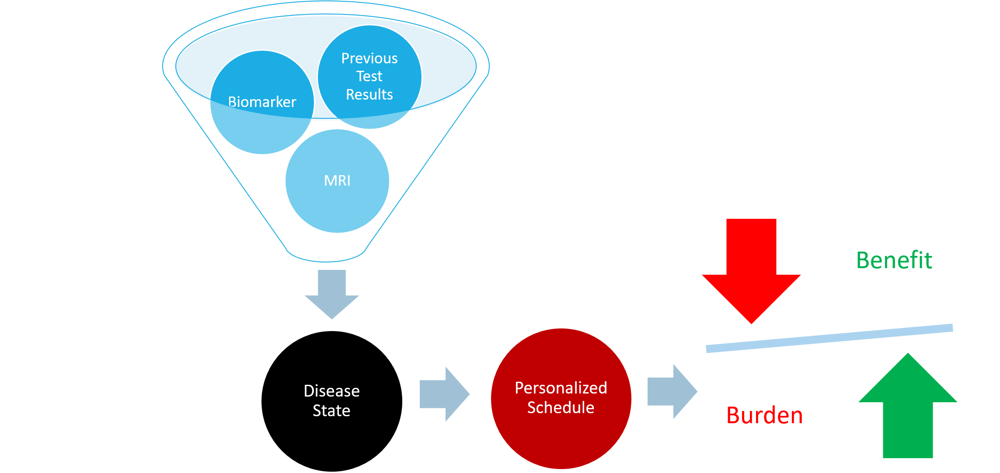

# Step 1: Combine Patient Data To Obtain Disease State

## Joint Model: Time-to-event and Longitudinal Data
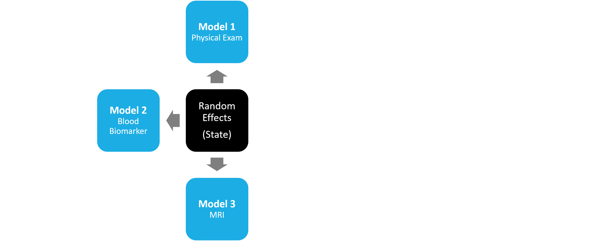

Shared Random Effects Multivariate Mixed Model

## Time to Progression: Relative-risk Sub-model
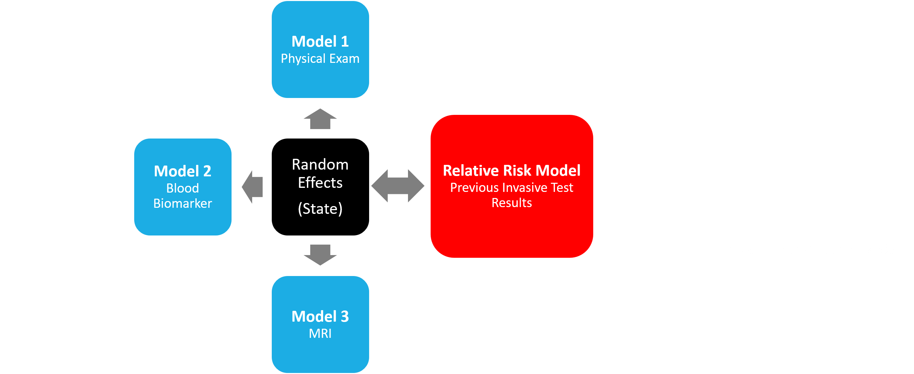

## Result: Cumulative-risk of Disease Progression
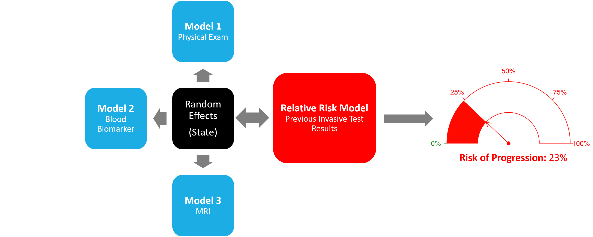

## result:
make a movable risk plot

# Step 2: Use the Predicted Risk-Profile To Make Personalized Schedule

## Focus on Delay In Detecting Progression
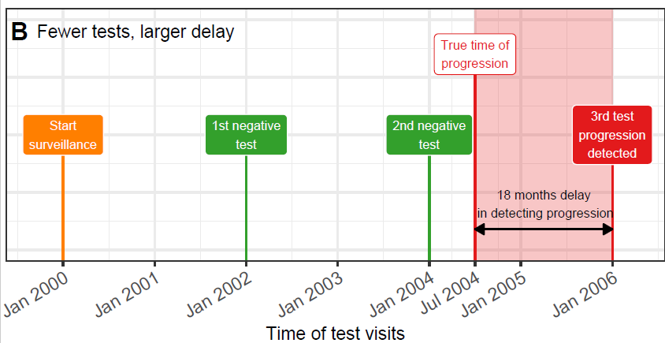

## When Overshooting the Target and Undershooting the Target Are Equally Worse

Remember Dimitris' comment about being non technical
- Squared loss: minimize square of the time difference
    - Mean/Expected time of progression
- Absolute loss: minimize absolute time difference
    - Median time of progression
    
## Ovreshooting is Worse Than Undershooting
- Multilinear loss
    - Risk threshold based approach
    - Plan a test whenever risk of progression is above a threshold (e.g., 5% risk).
    - Lower thresholds means more chance of undershooting and low chance of overshooting.
    
## Simulation Study